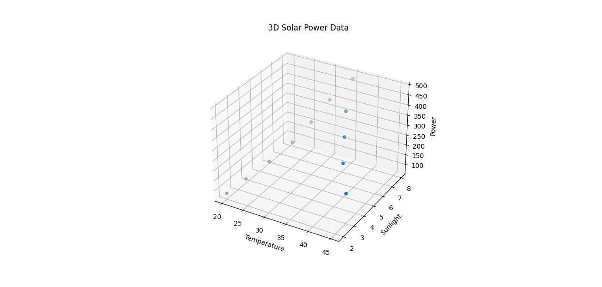
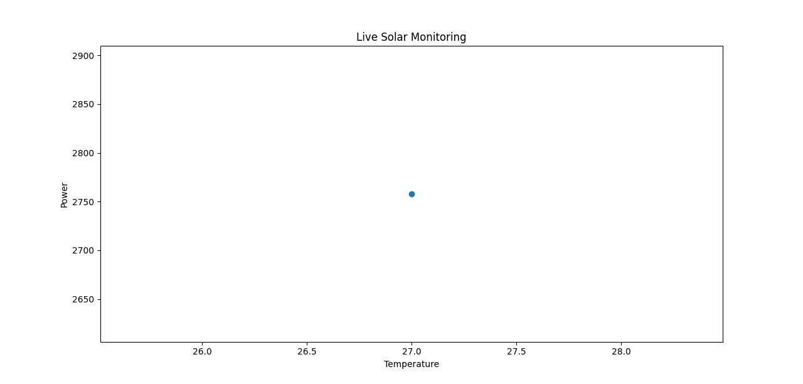
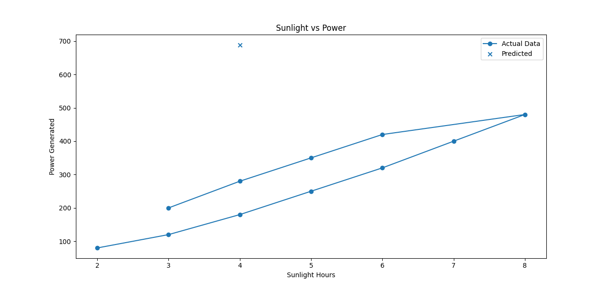

# ☀️ Solar AI System

An AI-based system that predicts solar power generation using environmental conditions.

---

## ❗ Problem Statement
Solar power generation varies due to environmental factors like temperature, sunlight, humidity, and dust.  
This project predicts power output and detects system performance using AI.

---

## 🚀 Features
- 🔋 Power prediction using Machine Learning
- ⚠️ Fault detection system
- 📊 Data visualization (2D & 3D graphs)
- 🔄 Real-time monitoring simulation

---

## 🛠️ Technologies Used
- Python
- Pandas
- Scikit-learn
- Matplotlib

---

## 📊 Project Output

### 📈 Graph Output

### 🔢 System Output

---

## 🧠 How It Works
1. User inputs Temperature, Sunlight, Humidity, Dust Level  
2. Model predicts power generation  
3. System checks performance  
4. Real-time simulation shows live monitoring  

---

## ▶️ How to Run

1. Install required libraries:
2. pip install -r requirements.txt
   
   pandas, 
    scikit-learn, 
    matplotlib

   ---

### Run the program
1. python solar_ai_model.py
